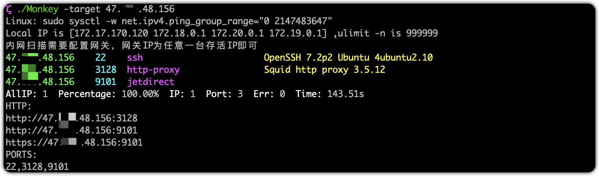

## 简介

> 基于nmap、masscan的端口扫描工具

## 使用

```bash
$ sudo ./Monkey -h
Linux: sudo sysctl -w net.ipv4.ping_group_range="0 2147483647"
Local IP is [192.168.67.74 198.18.0.1] ,ulimit -n is 10240
内网扫描需要配置网关，网关IP为任意一台存活IP即可
Usage of ./Monkey:
  -blast
    	blast service
  -masscan-rate string
    	masscan rate (default "1000")
  -nmap-sv string
    	nmap version intensity,optional 0~9 (default "2")
  -port string
    	specify scan ports (default "0-65535")
  -target string
    	specify target ip
  -targets string
    	specify target ip from file
  -thread int
    	specify scan threads (default 6)
  -timeout int
    	web request timeout (default 10)
```



## 代办

- [x] 端口扫描
- [x] 指纹识别
- [x] 暴力破解
- [x] 网站识别
- [x] 优化IP解析