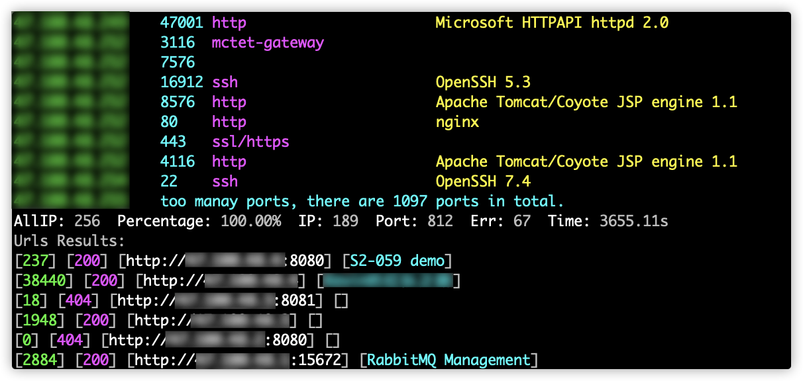

## 简介

> 基于 nmap + masscan

## 编译

```bash
go get github.com/bufsnake/Monkey

cd $GOPATH/src/github.com/bufsnake/Monkey/cmd/Monkey/

go build -v
```

## 用法

```bash
└> ./Monkey
Usage of ./Monkey:
  -f string
    	specify target ip from file
  -m string
    	masscan rate (default "1000")
  -n string
    	nmap version intensity,optional 0~9 (default "2")
  -p string
    	specify scan ports (default "0-65535")
  -r int
    	specify scan rate (default 6)
  -t string
    	specify target ip
  -w int
    	web request timeout (default 10)
```

## 截图

