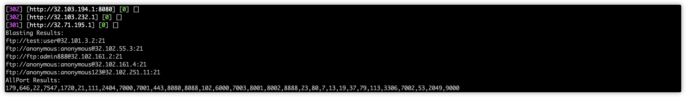

## 简介

> 基于nmap、masscan、go socket的端口扫描工具
## 使用

```bash
└> ./Monkey
Local IP is [192.168.31.60] ,ulimit -n is 10240
Linux: sudo sysctl -w net.ipv4.ping_group_range="0 2147483647"
Usage of ./Monkey:
  -b	whether to blast
  -f string
    	specify target ip from file
  -m string
    	masscan rate (default "1000")
  -n string
    	nmap version intensity,optional 0~9 (default "2")
  -np
    	whether to ping scan ip alive
  -p string
    	specify scan ports (default "0-65535")
  -r int
    	specify scan rate (default 6)
  -st int
    	socket port scan thread (default 200)
  -t string
    	specify target ip
  -um
    	use masscan(IM: use in public network)
  -w int
    	web request timeout (default 10)
```

## 结果




## TODO

- [x] 端口扫描
- [x] 指纹识别
- [x] 暴力破解
- [x] 网站识别
- [x] 优化IP解析
